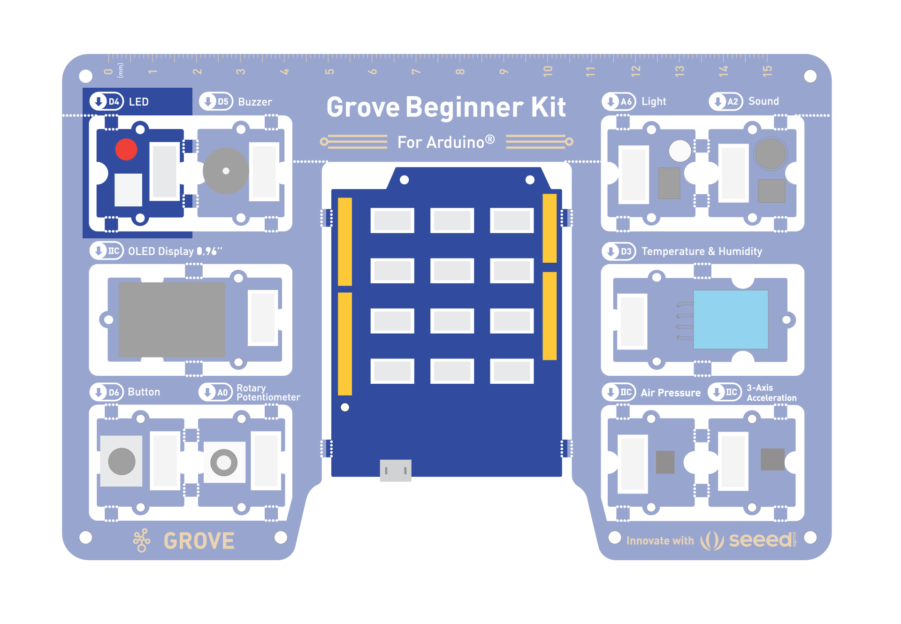
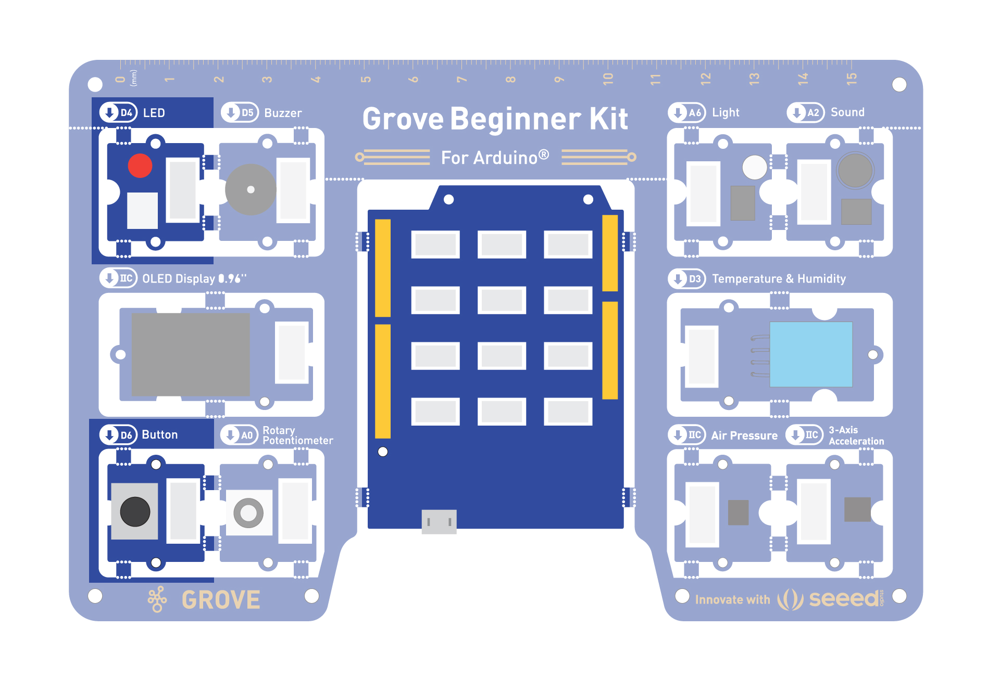
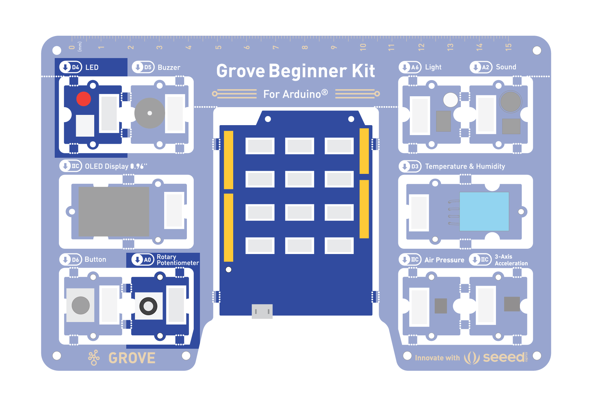
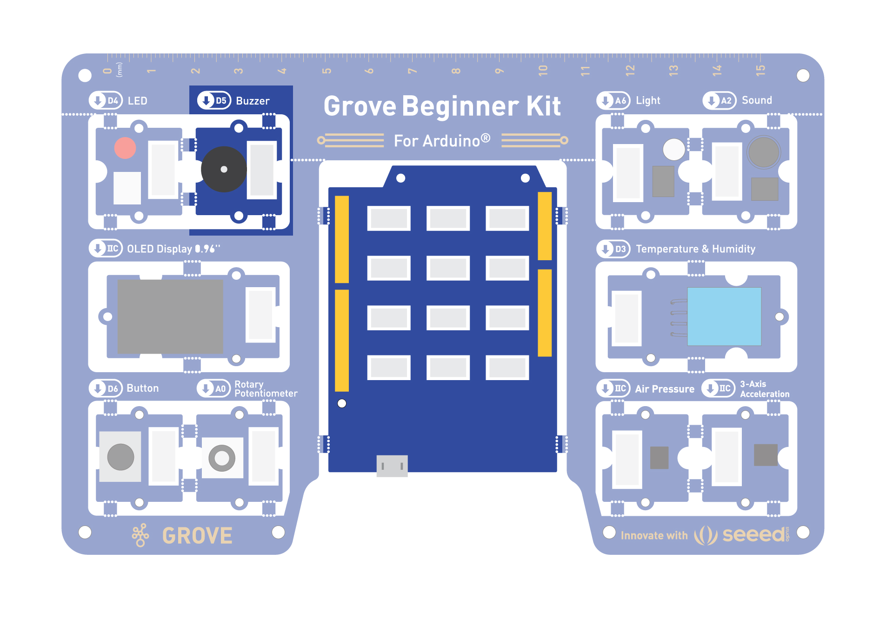

# Grove Arduino Code Samples
{:.no_toc}

## Table of contents
{: .no_toc .text-delta }

1. TOC
{:toc}

---

## Info

This website serves as a collection of code samples for the Grove Arduino Beginner Kit. Use these code examples as a starting point and modify the code samples for your projects. 

Every project will have a set of sensors, actuators, and one microcontroller. 

Let's first look at our base board. This is what your hardware should look like: 


## Components 

- Microcontroller - Arduino Uno


### Sensors 
- Button 
- Potentiometer
- Microphone (or sound sensor)
- Light Sensor
- Temperature and humidity 

### Actuators 
- LED Light 
- Servo motors 
- Speaker (or Buzzer)
- OLED Display

## Programming the Board

This is a plug and play board! Which means no wiring required unless we cut out the components. 

Let's try out some simple code examples. 

### Blinking with an LED

You need: 
- Control: Seeeduino
- Output: LED module




```
//LED Blink
//The LED will turn on for one second and then turn off for one second
int ledPin = 4;
void setup() {
    pinMode(ledPin, OUTPUT);
}
void loop() {
    digitalWrite(ledPin, HIGH);
    delay(1000);
    digitalWrite(ledPin, LOW);
    delay(1000);
}
```

### Pressing Button to Light Up LED 

You need: 
- Input: Button
- Control: Seeeduino
- Output: LED module



```
//Button to turn ON/OFF LED
//Constants won't change. They're used here to set pin numbers:
const int buttonPin = 6;     // the number of the pushbutton pin
const int ledPin =  4;      // the number of the LED pin

// variables will change:
int buttonState = 0;         // variable for reading the pushbutton status

void setup() {
  // initialize the LED pin as an output:
  pinMode(ledPin, OUTPUT);
  // initialize the pushbutton pin as an input:
  pinMode(buttonPin, INPUT);
}

void loop() {
  // read the state of the pushbutton value:
  buttonState = digitalRead(buttonPin);

  // check if the pushbutton is pressed. If it is, the buttonState is HIGH:
  if (buttonState == HIGH) {
    // turn LED on:
    digitalWrite(ledPin, HIGH);
  } else {
    // turn LED off:
    digitalWrite(ledPin, LOW);
  }
}
```

### Controlling the Frequency of the Blink with a Potentiometer

You need: 
- Input: Potentiometer
- Control: Seeeduino
- Output: LED module



```
//Rotary controls LED
int rotaryPin = A0;    // select the input pin for the rotary
int ledPin = 4;      // select the pin for the LED
int rotaryValue = 0;  // variable to store the value coming from the rotary

void setup() {
  // declare the ledPin as an OUTPUT:
  pinMode(ledPin, OUTPUT);
  pinMode(rotaryPin, INPUT);
}

void loop() {
  // read the value from the sensor:
  rotaryValue = analogRead(rotaryPin);
  // turn the ledPin on
  digitalWrite(ledPin, HIGH);
  // stop the program for <sensorValue> milliseconds:
  delay(rotaryValue);
  // turn the ledPin off:
  digitalWrite(ledPin, LOW);
  // stop the program for for <sensorValue> milliseconds:
  delay(rotaryValue);
}
```

### Making the Buzzer go BEEP

You need: 
- Control: Seeeduino
- Output: LED Buzzer



```
int BuzzerPin = 5;

void setup() {
  pinMode(BuzzerPin, OUTPUT);
}

void loop() {
  analogWrite(BuzzerPin, 128);
  delay(1000);
  analogWrite(BuzzerPin, 0);
  delay(0);
}
```

*Challenge: Can you make the buzzer go beep when the button is pressed?*


### Making the Buzzer be more pleasant! 

You need: 
- Control: Seeeduino
- Output: LED Buzzer

Your current code is just outputting a constant PWM signal, which creates a simple (albeit annoying) buzz. To play a tune, it's better to use Arduino's tone() function, which generates specific musical notes.


```
int BuzzerPin = 5;

void setup() {
}

void loop() {
  // Melody notes (Hz)
  int melody[] = {
    262, 330, 392, 523,   // C4 E4 G4 C5
    392, 523, 659,        // G4 C5 E5
    784, 659, 523, 392,   // G5 E5 C5 G4
    523
  };

  // Note durations (ms)
  int duration[] = {
    150, 150, 150, 300,
    150, 150, 300,
    200, 200, 200, 200,
    500
  };

  int notes = sizeof(melody) / sizeof(melody[0]);

  for (int i = 0; i < notes; i++) {
    tone(BuzzerPin, melody[i], duration[i]);
    delay(duration[i] * 1.3);
  }

  noTone(BuzzerPin);

  delay(2000);  // Pause before repeating
}
```

*Challenge: Try out some different notes, and see what happens.*


