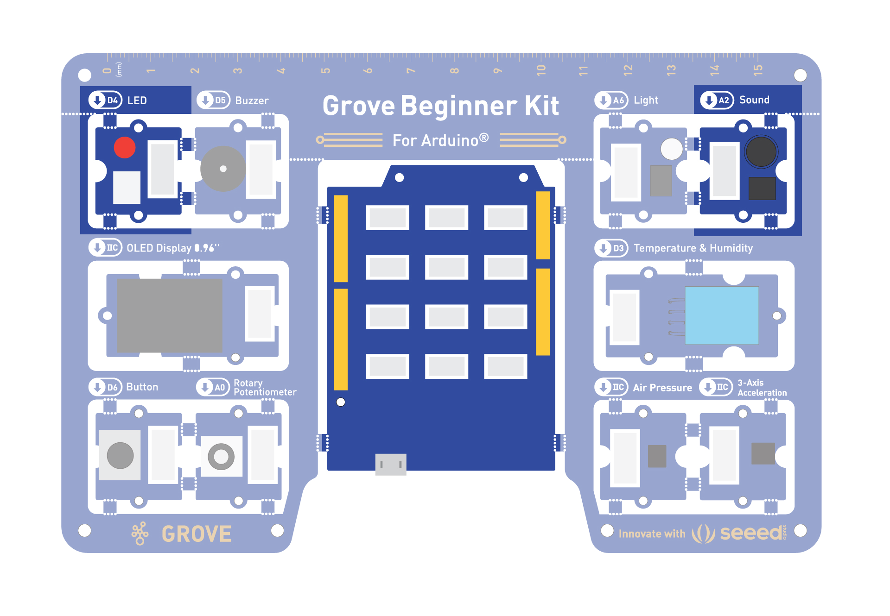
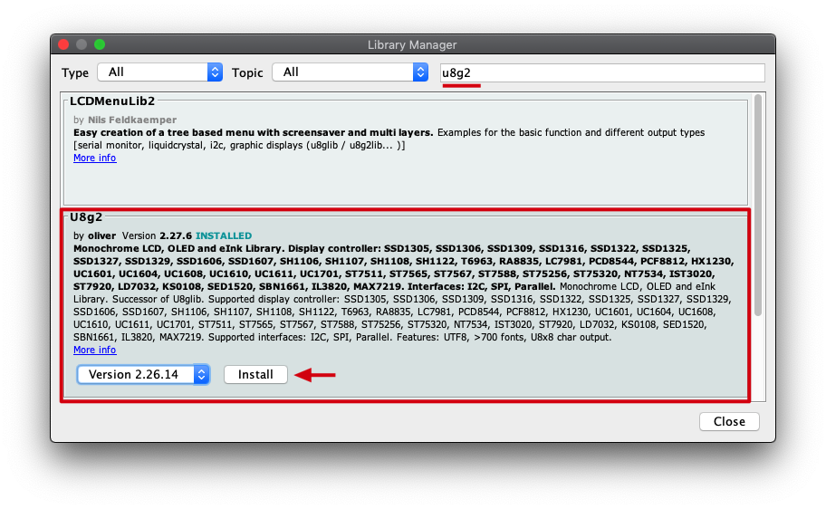
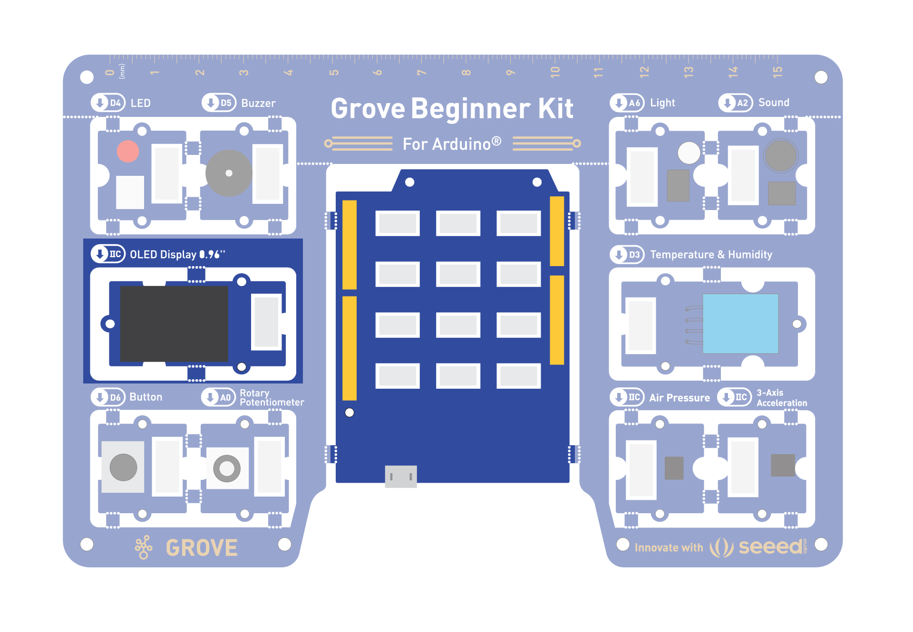

# Grove Arduino Code Samples
{:.no_toc}

## Table of contents
{: .no_toc .text-delta }

1. TOC
{:toc}

---

## Info

This website serves as a collection of code samples for the Grove Arduino Beginner Kit. Use these code examples as a starting point and modify the code samples for your projects. 

Every project will have a set of sensors, actuators, and one microcontroller. 

Let's first look at our base board. This is what your hardware should look like: 


## Components 

- Microcontroller - Arduino Uno


### Sensors 
- Button 
- Potentiometer
- Microphone (or sound sensor)
- Light Sensor
- Temperature and humidity 

### Actuators 
- LED Light 
- Servo motors 
- Speaker (or Buzzer)
- OLED Display

## Programming the Board

This is a plug and play board! Which means no wiring required unless we cut out the components. 

Let's try out some simple code examples. 

### Blinking with an LED

You need: 
- Control: Seeeduino
- Output: LED module


```
//LED Blink
//The LED will turn on for one second and then turn off for one second
int ledPin = 4;
void setup() {
    pinMode(ledPin, OUTPUT);
}
void loop() {
    digitalWrite(ledPin, HIGH);
    delay(1000);
    digitalWrite(ledPin, LOW);
    delay(1000);
}
```

### Pressing Button to Light Up LED 

You need: 
- Input: Button
- Control: Seeeduino
- Output: LED module


```
//Button to turn ON/OFF LED
//Constants won't change. They're used here to set pin numbers:
const int buttonPin = 6;     // the number of the pushbutton pin
const int ledPin =  4;      // the number of the LED pin

// variables will change:
int buttonState = 0;         // variable for reading the pushbutton status

void setup() {
  // initialize the LED pin as an output:
  pinMode(ledPin, OUTPUT);
  // initialize the pushbutton pin as an input:
  pinMode(buttonPin, INPUT);
}

void loop() {
  // read the state of the pushbutton value:
  buttonState = digitalRead(buttonPin);

  // check if the pushbutton is pressed. If it is, the buttonState is HIGH:
  if (buttonState == HIGH) {
    // turn LED on:
    digitalWrite(ledPin, HIGH);
  } else {
    // turn LED off:
    digitalWrite(ledPin, LOW);
  }
}
```
### Controlling the LED with a button toggle

This code makes the button a toggle -- pressing it once turns the light on, pressing it again turns it off.

You need:
- Input: Button
- Control: Seeeduino
- Output: LED module


```
const int buttonPin = 6;
const int ledPin = 4;

bool ledState = false;       // current state of the LED
bool lastButtonState = HIGH; // button is HIGH when NOT pressed (pull-up)

void setup() {
  pinMode(buttonPin, INPUT);
  pinMode(ledPin, OUTPUT);
}

void loop() {
  bool currentButtonState = digitalRead(buttonPin);

  // Detect the moment the button goes from not-pressed to pressed
  if (currentButtonState == LOW && lastButtonState == HIGH) {
    ledState = !ledState;              // flip the LED state
    digitalWrite(ledPin, ledState);
    delay(200);                         // simple debounce
  }

  lastButtonState = currentButtonState;
}
```

### Controlling the Frequency of the Blink with a Potentiometer

You need: 
- Input: Potentiometer
- Control: Seeeduino
- Output: LED module


```
//Rotary controls LED
int rotaryPin = A0;    // select the input pin for the rotary
int ledPin = 4;      // select the pin for the LED
int rotaryValue = 0;  // variable to store the value coming from the rotary

void setup() {
  // declare the ledPin as an OUTPUT:
  pinMode(ledPin, OUTPUT);
  pinMode(rotaryPin, INPUT);
}

void loop() {
  // read the value from the sensor:
  rotaryValue = analogRead(rotaryPin);
  // turn the ledPin on
  digitalWrite(ledPin, HIGH);
  // stop the program for <sensorValue> milliseconds:
  delay(rotaryValue);
  // turn the ledPin off:
  digitalWrite(ledPin, LOW);
  // stop the program for for <sensorValue> milliseconds:
  delay(rotaryValue);
}
```

### Making the Buzzer go BEEP

You need: 
- Control: Seeeduino
- Output: Buzzer


```
int BuzzerPin = 5;

void setup() {
  pinMode(BuzzerPin, OUTPUT);
}

void loop() {
  analogWrite(BuzzerPin, 128);
  delay(1000);
  analogWrite(BuzzerPin, 0);
  delay(0);
}
```

*Challenge: Can you make the buzzer go beep when the button is pressed?*


### Making the Buzzer be more pleasant! 

You need: 
- Control: Seeeduino
- Output: Buzzer

Your current code is just outputting a constant PWM signal, which creates a simple (albeit annoying) buzz. To play a tune, it's better to use Arduino's tone() function, which generates specific musical notes.


```
int BuzzerPin = 5;

void setup() {
}

void loop() {
  // Melody notes (Hz)
  int melody[] = {
    262, 330, 392, 523,   // C4 E4 G4 C5
    392, 523, 659,        // G4 C5 E5
    784, 659, 523, 392,   // G5 E5 C5 G4
    523
  };

  // Note durations (ms)
  int duration[] = {
    150, 150, 150, 300,
    150, 150, 300,
    200, 200, 200, 200,
    500
  };

  int notes = sizeof(melody) / sizeof(melody[0]);

  for (int i = 0; i < notes; i++) {
    tone(BuzzerPin, melody[i], duration[i]);
    delay(duration[i] * 1.3);
  }

  noTone(BuzzerPin);

  delay(2000);  // Pause before repeating
}
```

*Challenge: Try out some different notes, and see what happens.*

### Mario Time! 

What if you want to make the Mario tune play? Let's try a really complex combination of notes. 

You need: 
- Control: Seeeduino
- Output: Buzzer


```
#define NOTE_B0  31
#define NOTE_C1  33
#define NOTE_CS1 35
#define NOTE_D1  37
#define NOTE_DS1 39
#define NOTE_E1  41
#define NOTE_F1  44
#define NOTE_FS1 46
#define NOTE_G1  49
#define NOTE_GS1 52
#define NOTE_A1  55
#define NOTE_AS1 58
#define NOTE_B1  62
#define NOTE_C2  65
#define NOTE_CS2 69
#define NOTE_D2  73
#define NOTE_DS2 78
#define NOTE_E2  82
#define NOTE_F2  87
#define NOTE_FS2 93
#define NOTE_G2  98
#define NOTE_GS2 104
#define NOTE_A2  110
#define NOTE_AS2 117
#define NOTE_B2  123
#define NOTE_C3  131
#define NOTE_CS3 139
#define NOTE_D3  147
#define NOTE_DS3 156
#define NOTE_E3  165
#define NOTE_F3  175
#define NOTE_FS3 185
#define NOTE_G3  196
#define NOTE_GS3 208
#define NOTE_A3  220
#define NOTE_AS3 233
#define NOTE_B3  247
#define NOTE_C4  262
#define NOTE_CS4 277
#define NOTE_D4  294
#define NOTE_DS4 311
#define NOTE_E4  330
#define NOTE_F4  349
#define NOTE_FS4 370
#define NOTE_G4  392
#define NOTE_GS4 415
#define NOTE_A4  440
#define NOTE_AS4 466
#define NOTE_B4  494
#define NOTE_C5  523
#define NOTE_CS5 554
#define NOTE_D5  587
#define NOTE_DS5 622
#define NOTE_E5  659
#define NOTE_F5  698
#define NOTE_FS5 740
#define NOTE_G5  784
#define NOTE_GS5 831
#define NOTE_A5  880
#define NOTE_AS5 932
#define NOTE_B5  988
#define NOTE_C6  1047
#define NOTE_CS6 1109
#define NOTE_D6  1175
#define NOTE_DS6 1245
#define NOTE_E6  1319
#define NOTE_F6  1397
#define NOTE_FS6 1480
#define NOTE_G6  1568
#define NOTE_GS6 1661
#define NOTE_A6  1760
#define NOTE_AS6 1865
#define NOTE_B6  1976
#define NOTE_C7  2093
#define NOTE_CS7 2217
#define NOTE_D7  2349
#define NOTE_DS7 2489
#define NOTE_E7  2637
#define NOTE_F7  2794
#define NOTE_FS7 2960
#define NOTE_G7  3136
#define NOTE_GS7 3322
#define NOTE_A7  3520
#define NOTE_AS7 3729
#define NOTE_B7  3951
#define NOTE_C8  4186
#define NOTE_CS8 4435
#define NOTE_D8  4699
#define NOTE_DS8 4978

#define melodyPin 5
//Mario main theme melody
int melody[] = {
  NOTE_E7, NOTE_E7, 0, NOTE_E7,
  0, NOTE_C7, NOTE_E7, 0,
  NOTE_G7, 0, 0,  0,
  NOTE_G6, 0, 0, 0,

  NOTE_C7, 0, 0, NOTE_G6,
  0, 0, NOTE_E6, 0,
  0, NOTE_A6, 0, NOTE_B6,
  0, NOTE_AS6, NOTE_A6, 0,

  NOTE_G6, NOTE_E7, NOTE_G7,
  NOTE_A7, 0, NOTE_F7, NOTE_G7,
  0, NOTE_E7, 0, NOTE_C7,
  NOTE_D7, NOTE_B6, 0, 0,

  NOTE_C7, 0, 0, NOTE_G6,
  0, 0, NOTE_E6, 0,
  0, NOTE_A6, 0, NOTE_B6,
  0, NOTE_AS6, NOTE_A6, 0,

  NOTE_G6, NOTE_E7, NOTE_G7,
  NOTE_A7, 0, NOTE_F7, NOTE_G7,
  0, NOTE_E7, 0, NOTE_C7,
  NOTE_D7, NOTE_B6, 0, 0
};
//Mario main them tempo
int tempo[] = {
  12, 12, 12, 12,
  12, 12, 12, 12,
  12, 12, 12, 12,
  12, 12, 12, 12,

  12, 12, 12, 12,
  12, 12, 12, 12,
  12, 12, 12, 12,
  12, 12, 12, 12,

  9, 9, 9,
  12, 12, 12, 12,
  12, 12, 12, 12,
  12, 12, 12, 12,

  12, 12, 12, 12,
  12, 12, 12, 12,
  12, 12, 12, 12,
  12, 12, 12, 12,

  9, 9, 9,
  12, 12, 12, 12,
  12, 12, 12, 12,
  12, 12, 12, 12,
};
//Underworld melody
int underworld_melody[] = {
  NOTE_C4, NOTE_C5, NOTE_A3, NOTE_A4,
  NOTE_AS3, NOTE_AS4, 0,
  0,
  NOTE_C4, NOTE_C5, NOTE_A3, NOTE_A4,
  NOTE_AS3, NOTE_AS4, 0,
  0,
  NOTE_F3, NOTE_F4, NOTE_D3, NOTE_D4,
  NOTE_DS3, NOTE_DS4, 0,
  0,
  NOTE_F3, NOTE_F4, NOTE_D3, NOTE_D4,
  NOTE_DS3, NOTE_DS4, 0,
  0, NOTE_DS4, NOTE_CS4, NOTE_D4,
  NOTE_CS4, NOTE_DS4,
  NOTE_DS4, NOTE_GS3,
  NOTE_G3, NOTE_CS4,
  NOTE_C4, NOTE_FS4, NOTE_F4, NOTE_E3, NOTE_AS4, NOTE_A4,
  NOTE_GS4, NOTE_DS4, NOTE_B3,
  NOTE_AS3, NOTE_A3, NOTE_GS3,
  0, 0, 0
};
//Underwolrd tempo
int underworld_tempo[] = {
  12, 12, 12, 12,
  12, 12, 6,
  3,
  12, 12, 12, 12,
  12, 12, 6,
  3,
  12, 12, 12, 12,
  12, 12, 6,
  3,
  12, 12, 12, 12,
  12, 12, 6,
  6, 18, 18, 18,
  6, 6,
  6, 6,
  6, 6,
  18, 18, 18, 18, 18, 18,
  10, 10, 10,
  10, 10, 10,
  3, 3, 3
};

void setup(void)
{
  pinMode(5, OUTPUT);//buzzer
  pinMode(4, OUTPUT);//led indicator when singing a note

}
void loop()
{
  //sing the tunes
  sing(1);
  sing(1);
  sing(2);
}
int song = 0;

void sing(int s) {
  // iterate over the notes of the melody:
  song = s;
  if (song == 2) {
    Serial.println(" 'Underworld Theme'");
    int size = sizeof(underworld_melody) / sizeof(int);
    for (int thisNote = 0; thisNote < size; thisNote++) {

      // to calculate the note duration, take one second
      // divided by the note type.
      //e.g. quarter note = 1000 / 4, eighth note = 1000/8, etc.
      int noteDuration = 1000 / underworld_tempo[thisNote];

      buzz(melodyPin, underworld_melody[thisNote], noteDuration);

      // to distinguish the notes, set a minimum time between them.
      // the note's duration + 30% seems to work well:
      int pauseBetweenNotes = noteDuration * 1.30;
      delay(pauseBetweenNotes);

      // stop the tone playing:
      buzz(melodyPin, 0, noteDuration);

    }

  } else {

    Serial.println(" 'Mario Theme'");
    int size = sizeof(melody) / sizeof(int);
    for (int thisNote = 0; thisNote < size; thisNote++) {

      // to calculate the note duration, take one second
      // divided by the note type.
      //e.g. quarter note = 1000 / 4, eighth note = 1000/8, etc.
      int noteDuration = 1000 / tempo[thisNote];

      buzz(melodyPin, melody[thisNote], noteDuration);

      // to distinguish the notes, set a minimum time between them.
      // the note's duration + 30% seems to work well:
      int pauseBetweenNotes = noteDuration * 1.30;
      delay(pauseBetweenNotes);

      // stop the tone playing:
      buzz(melodyPin, 0, noteDuration);

    }
  }
}

void buzz(int targetPin, long frequency, long length) {
  digitalWrite(4, HIGH);
  long delayValue = 1000000 / frequency / 2; // calculate the delay value between transitions
  //// 1 second's worth of microseconds, divided by the frequency, then split in half since
  //// there are two phases to each cycle
  long numCycles = frequency * length / 1000; // calculate the number of cycles for proper timing
  //// multiply frequency, which is really cycles per second, by the number of seconds to
  //// get the total number of cycles to produce
  for (long i = 0; i < numCycles; i++) { // for the calculated length of time...
    digitalWrite(targetPin, HIGH); // write the buzzer pin high to push out the diaphram
    delayMicroseconds(delayValue); // wait for the calculated delay value
    digitalWrite(targetPin, LOW); // write the buzzer pin low to pull back the diaphram
    delayMicroseconds(delayValue); // wait again or the calculated delay value
  }
  digitalWrite(4, LOW);

}
```

### Sound Sensitive LED Light


You need: 
- Control: Seeeduino
- Input: Sound Sensor
- Output: LED Module




```
//Sound Control Light
int soundPin = A2; // Analog sound sensor is to be attached to analog
int ledPin = 4; // Digital LED is to be attached to digital
void setup() {
  pinMode(ledPin, OUTPUT);
  pinMode(soundPin, INPUT);
  Serial.begin(9600);
}
void loop(){
  int soundState = analogRead(soundPin); // Read sound sensor’s value
  Serial.println(soundState);
  // if the sound sensor’s value is greater than 400, the light will be on.
  //Otherwise, the light will be turned off
  if (soundState > 400) {
    digitalWrite(ledPin, HIGH);
    delay(100);
  }else{
    digitalWrite(ledPin, LOW);
  }
}
```

*Challenge: Now can you use the light sensor to adjust the LED?*

### Sreen time!!

For the OLED screen, we will be using an Arduino Library. 

#### Install the U8g2 library: 
Navigate to Sketch -> Include Library -> Manage Libraries... and Search for the keyword "U8g2" in the Library Manager. It's the u8g2 library by oliver, and click then install.



You need: 
- Seeeduino Lotus
- OLED screen 



```
#include <Arduino.h>
#include <U8x8lib.h>

 U8X8_SSD1306_128X64_NONAME_HW_I2C u8x8(/* reset=*/ U8X8_PIN_NONE);

// U8X8_SSD1306_128X64_NONAME_SW_I2C u8x8(/* clock=*/ SCL, /* data=*/ SDA, /* reset=*/ U8X8_PIN_NONE);   // OLEDs without Reset of the Display

void setup(void) {
  //u8x8.setBusClock(100000);  // If you breakout other modules, please enable this line
  u8x8.begin();
  u8x8.setFlipMode(1);
}

void loop(void) {
  u8x8.setFont(u8x8_font_chroma48medium8_r);
  u8x8.setCursor(0, 0);
  u8x8.print("Hello World!");
}
```

What if we want to control the screen using the Potentiometer? 

### OLED Control using Potentiometer

Let's try a fun project, where the OLED display disentegrates when you rotate the potentiometer. 

Project Plan: 
- Pot at minimum → clean "HELLO WORLD!"
- Rotate slowly → letters begin glitching into symbols.
- Rotate further → more letters corrupt.
- Near maximum → random debris appears across the screen, creating a digital disintegration look.


```
#include <Arduino.h>
#include <U8g2lib.h>
#include <Wire.h>

int rotaryPin = A0;

// Full framebuffer mode
U8G2_SSD1306_128X64_NONAME_F_HW_I2C u8g2(U8G2_R2, U8X8_PIN_NONE);

// Fast deterministic pseudo-random function
uint8_t noise8(uint16_t x, uint16_t y)
{
  uint32_t n = x * 1973UL + y * 9277UL + 89173UL;
  n = (n << 13) ^ n;
  return (n * (n * n * 15731UL + 789221UL) + 1376312589UL) >> 24;
}

void setup()
{
  u8g2.begin();
}

void loop()
{
  int pot = analogRead(rotaryPin);

  // 0 = intact, 255 = completely dissolved
  uint8_t dissolveAmount = map(pot, 0, 1023, 0, 255);

  // Draw text to framebuffer
  u8g2.clearBuffer();

  u8g2.setFont(u8g2_font_logisoso24_tf);

  const char *text = "HELLO";
  int x = 5;
  int y = 40;

  u8g2.drawStr(x, y, text);

  // Apply dissolve effect directly to framebuffer
  uint8_t *buf = u8g2.getBufferPtr();

  for (int py = 0; py < 64; py++)
  {
    for (int px = 0; px < 128; px++)
    {
      uint8_t rnd = noise8(px, py);

      if (rnd < dissolveAmount)
      {
        u8g2.setDrawColor(0);
        u8g2.drawPixel(px, py);
      }
    }
  }

  // Optional: add "dust" particles drifting away
  if (dissolveAmount > 100)
  {
    int particles = map(dissolveAmount, 100, 255, 0, 80);

    u8g2.setDrawColor(1);

    for (int i = 0; i < particles; i++)
    {
      int px = random(128);
      int py = random(64);

      if (noise8(px, py) < dissolveAmount)
      {
        // Drift right as dissolution increases
        int drift = map(dissolveAmount, 100, 255, 0, 25);

        u8g2.drawPixel(
          min(127, px + random(drift + 1)),
          py + random(-2, 3)
        );
      }
    }
  }

  u8g2.sendBuffer();

  delay(20);
}
```


### Get Moving - Servo Motors 

What if you want moving parts. We will use the Servo motors. Attach your Servos to desirable parts that you want to move using the connectors. 

You need: 
- Control: Seeeduino
- Output: A servo motor connected to pin D5. 
- Connectors: Servo motor connectors to attach physical parts to them. 

```
#include <Servo.h>

Servo myServo;  // Create servo object to control a servo
int pos = 0;    // Variable to store the servo position

void setup() {
  myServo.attach(5);  // Attaches the servo on digital pin 5 to the servo object
}

void loop() {
  for (pos = 0; pos <= 180; pos += 1) { // goes from 0 degrees to 180 degrees
    myServo.write(pos);              // tell servo to go to position in variable 'pos'
    delay(5);                       // waits 15ms for the servo to reach the position
  }
  for (pos = 180; pos >= 0; pos -= 1) { // goes from 180 degrees to 0 degrees
    myServo.write(pos);              // tell servo to go to position in variable 'pos'
    delay(5);                       // waits 15ms for the servo to reach the position
  }
}
```


