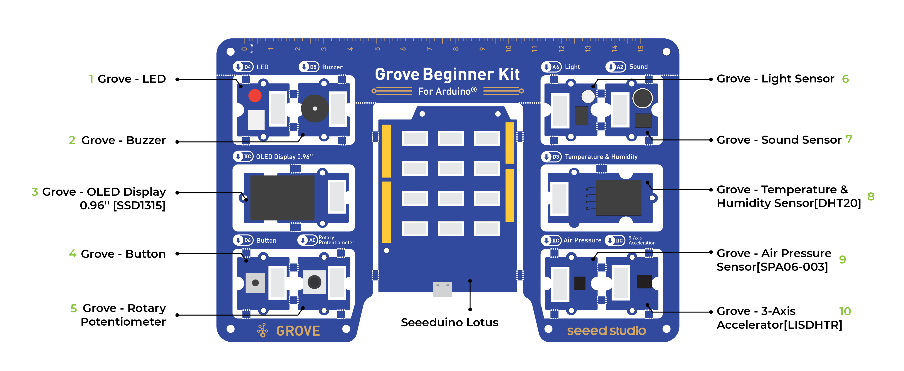

# Grove Arduino Code Samples
{:.no_toc}

## Table of contents
{: .no_toc .text-delta }

1. TOC
{:toc}

---

## Info

This website serves as a collection of code samples for the Grove Arduino Beginner Kit. Use these code examples as a starting point and modify the code samples for your projects. 

Every project will have a set of sensors, actuators, and one microcontroller. 

Let's first look at our base board. This is what your hardware should look like: 

## Components 

- Microcontroller - Arduino Uno

### Sensors 
- Button 
- Potentiometer
- Microphone
- Temperature and humidity 

### Actuators 
- LED Light 
- Servo motors 
- Speaker (or buzzer)